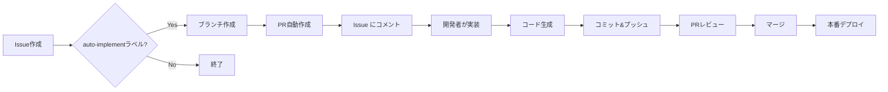

# 🤖 自動実装ワークフロー

このリポジトリでは、GitHub IssuesからGitHub Copilotを活用した自動実装フローを提供しています。

## 📋 使い方

### 1. Issueを作成

新しい機能追加、バグ修正、仕様変更などのIssueを作成します。

**Issue例:**
```
タイトル: 12/8の記事を追加

本文:
日付: 12/8
タイトル: GitHub ActionsでCI/CD構築
URL: https://tech.nri-net.com/entry/github_actions_cicd
```

または

```
タイトル: カレンダーにダークモードを追加

本文:
ユーザーがダークモード/ライトモードを切り替えられる機能を追加したい。
- トグルボタンを右上に配置
- localStorageで設定を保存
- システム設定を尊重
```

### 2. `auto-implement` ラベルを付ける

Issueに `auto-implement` ラベルを追加すると、自動的にワークフローが開始されます。

### 3. 自動的に実行されること

1. ✅ `feature/issue-{番号}` ブランチが作成される
2. ✅ PRが自動作成される
3. ✅ Issueに実装手順のコメントが投稿される
4. ✅ Issueに `in-progress` ラベルが追加される

### 4. 実装する（3つの選択肢）

#### オプション1: GitHub Copilot Workspace（推奨）🌟

最も簡単で強力な方法です。

1. 作成されたPRのリンクをクリック
2. [GitHub Copilot Workspace](https://githubnext.com/projects/copilot-workspace) で開く
3. Issueの内容を伝えてCopilotに実装を依頼
4. 生成されたコードをレビューしてコミット

#### オプション2: VS Code + GitHub Copilot Chat 💻

ローカル環境で実装します。

```bash
git fetch origin
git checkout feature/issue-{番号}

# VS Codeで開く
code .
```

VS Codeで:
1. Copilot Chatを開く（Ctrl+Shift+I / Cmd+Shift+I）
2. `@workspace #{Issue番号}の内容を実装して` と入力
3. 提案されたコードを確認
4. コミット＆プッシュ

```bash
git add .
git commit -m "Implement: Issue内容"
git push
```

#### オプション3: 手動実装 🛠️

従来通りの手動実装も可能です。

```bash
git fetch origin
git checkout feature/issue-{番号}

# 実装作業
# ファイルを編集...

git add .
git commit -m "Implement: 機能名"
git push
```

### 5. PRをレビュー＆マージ

実装が完了したら:
1. PRをレビュー
2. Netlify Deploy Previewで動作確認
3. 問題なければマージ
4. 自動的に本番環境にデプロイされます

## 🎯 対応可能な実装例

### 記事追加
```
日付: 12/10
タイトル: 新しい記事
URL: https://example.com/article
```

### UI改善
```
カレンダーのホバーエフェクトをより滑らかにする
- transition時間を0.3sから0.2sに変更
- transformにscale(1.02)を追加
```

### 新機能追加
```
検索機能を追加
- 記事タイトルで検索できるようにする
- 検索ボックスをヘッダーに配置
- リアルタイムフィルタリング
```

### バグ修正
```
モバイルでカレンダーグリッドが崩れる問題を修正
- 480px以下で2列表示に変更
- パディングを調整
```

### 設定変更
```
ビルドコマンドを最適化
- Viteのビルドオプションにminify追加
- チャンクサイズを制限
```

## ⚙️ セットアップ（初回のみ）

### 1. GitHub設定

**Workflow permissions:**
1. リポジトリの「Settings」→「Actions」→「General」
2. 「Workflow permissions」を **「Read and write permissions」** に変更
3. 「Allow GitHub Actions to create and approve pull requests」をチェック

### 2. ラベル作成

以下のラベルを作成してください:
- `auto-implement` (色: #0E8A16) - 自動実装トリガー
- `in-progress` (色: #FBCA04) - 実装中
- `auto-generated` (色: #D4C5F9) - 自動生成されたPR

### 3. GitHub Copilot有効化（推奨）

- [GitHub Copilot](https://github.com/features/copilot) を有効にする
- VS Codeに[GitHub Copilot拡張機能](https://marketplace.visualstudio.com/items?itemName=GitHub.copilot)をインストール

## 📊 ワークフローの流れ



## 🔧 カスタマイズ

`.github/workflows/auto-implement.yml` を編集することで、ワークフローをカスタマイズできます。

## 💡 Tips

- **具体的に書く**: Issueの内容は具体的であるほど、Copilotが正確に実装できます
- **例を示す**: 期待する動作やコード例を含めると効果的です
- **段階的に**: 大きな変更は複数のIssueに分割することを推奨します
- **レビュー必須**: 自動生成されたコードは必ずレビューしてください

## 🆘 トラブルシューティング

### ワークフローが実行されない
- `auto-implement` ラベルが正しく付いているか確認
- Workflow permissionsが正しく設定されているか確認

### PRが作成されない
- GitHub Actionsのログを確認
- ブランチ名が重複していないか確認

### 実装方法がわからない
- Issueのコメントに記載された手順を確認
- Copilot Workspaceの[ドキュメント](https://githubnext.com/projects/copilot-workspace)を参照

## 📚 関連リンク

- [GitHub Copilot Workspace](https://githubnext.com/projects/copilot-workspace)
- [GitHub Actions ドキュメント](https://docs.github.com/actions)
- [GitHub Copilot ドキュメント](https://docs.github.com/copilot)
